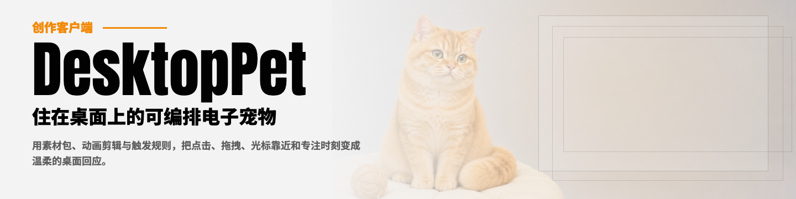
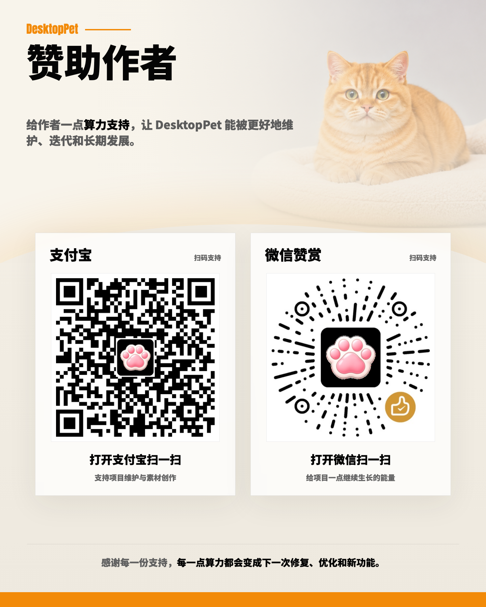

# Desktop Pet



一个跨平台的 Electron 桌面宠物客户端。你可以用照片和视频把自己家的宠物带到屏幕上，通过动画、点击、拖拽、鼠标移动、定时任务和番茄钟等方式与它互动。

[在线官网](https://duzexu.github.io/desktop-pet/) · [使用手册](https://duzexu.github.io/desktop-pet/manual.html)

[下载 macOS](https://github.com/duzexu/desktop-pet/releases/latest/download/Desktop-Pet-mac.dmg) · [下载 Windows](https://github.com/duzexu/desktop-pet/releases/latest/download/Desktop-Pet-windows.exe) · [全部版本](https://github.com/duzexu/desktop-pet/releases)

## 功能特性

- **桌面宠物**：透明无边框窗口，支持置顶、缩放、透明度、位置锁定和鼠标穿透。
- **Petpack 素材包**：导入或导出 `.petpack`，轻松更换宠物和分享配置。
- **丰富动画**：支持 GIF、WebP、WebM、MP4、MOV、PNG、SVG，以及默认、单次、循环和关键帧动画。
- **自定义互动**：通过条件、动作、优先级和冷却时间组合点击、拖拽、悬停、定时等行为。
- **独立控制面板**：集中管理素材、动画、互动规则、显示设置和系统设置。
- **即时生效**：保存设置后无需重启，宠物会立即使用新的动画和规则。
- **本地运行**：素材包和配置保存在本机，导入内容会经过路径、格式和引用检查。
- **中英文界面**：内置中文和英文，可在系统设置中切换。

## 快速开始

1. 下载并安装 [macOS 版本](https://github.com/duzexu/desktop-pet/releases/latest/download/Desktop-Pet-mac.dmg) 或 [Windows 版本](https://github.com/duzexu/desktop-pet/releases/latest/download/Desktop-Pet-windows.exe)。
2. 首次启动时控制面板会自动打开；也可以右键桌面宠物或点击系统托盘图标打开。
3. 点击 **导入体验包 / Import sample petpack**，应用会自动下载、校验、安装并切换到「淘淘」体验包。
4. 导入成功后，试试点击、拖拽宠物，或把光标移到它附近。

体验完整交互后，可以继续添加自己家宠物的照片和视频素材。具体流程见 [使用手册](https://duzexu.github.io/desktop-pet/manual.html#petpack)。

### 从源码运行

请先安装 Node.js 和 npm，然后在项目目录运行：

```bash
npm install
npm run dev
```

开发模式启动后，同样可以通过右键桌面宠物或系统托盘图标打开控制面板。

## 基本使用

1. 打开控制面板，在 **Assets** 页面导入素材或 `.petpack` 文件。
2. 在 **Animations** 页面选择默认动画，并添加单次、循环或关键帧动画。
3. 在 **Rules** 页面设置触发条件和执行动作，例如点击后播放动画或显示消息。
4. 在 **Display** 页面调整缩放、透明度、置顶和鼠标穿透。
5. 在 **System** 页面切换语言、设置开机启动或查看日志。

如果你想制作和分享自己的宠物包，请阅读 [在线用户手册](https://duzexu.github.io/desktop-pet/manual.html)。

## 常用命令

```bash
npm run dev              # 启动 Electron 应用
npm test                 # 运行单元测试
npm run test:e2e         # 运行端到端测试
npm run build            # 构建应用
npm run pack             # 打包应用目录
npm run dist             # 生成安装包
```

更多开发、测试和项目结构说明见 [开发指南](docs/DEVELOPMENT.md)。

## 文档

### 使用与创作

- [在线官网](https://duzexu.github.io/desktop-pet/)
- [用户手册：制作桌面宠物包](https://duzexu.github.io/desktop-pet/manual.html)

### 开发与设计

- [开发指南](docs/DEVELOPMENT.md)
- [当前架构](docs/architecture/current-architecture.md)
- [控制面板架构](docs/panel-architecture.md)
- [状态型规则设计](docs/stateful-rules-design.md)
- [产品需求文档](docs/requirements/desktop-client-prd.md)
- [更新日志](CHANGELOG.md)
- [发布清单](docs/release/client-release-checklist.md)

## 赞助作者

Desktop Pet 是免费开源项目。如果它让你的桌面变得更有趣，欢迎支持项目的维护、修复和后续功能开发。



- 爱发电：<https://www.ifdian.net/a/desktop-pet?utm_source=copylink&utm_medium=link>
- 支付宝 / 微信赞赏：扫描上方二维码。

感谢每一份支持。

## 社区

本项目在 LINUX DO 社区进行开源推广，感谢社区佬友的交流、反馈与建议。

* [LINUX DO](https://linux.do/)

## 许可证

本项目采用 GPL-3.0 许可证，详见 [LICENSE](LICENSE)。
